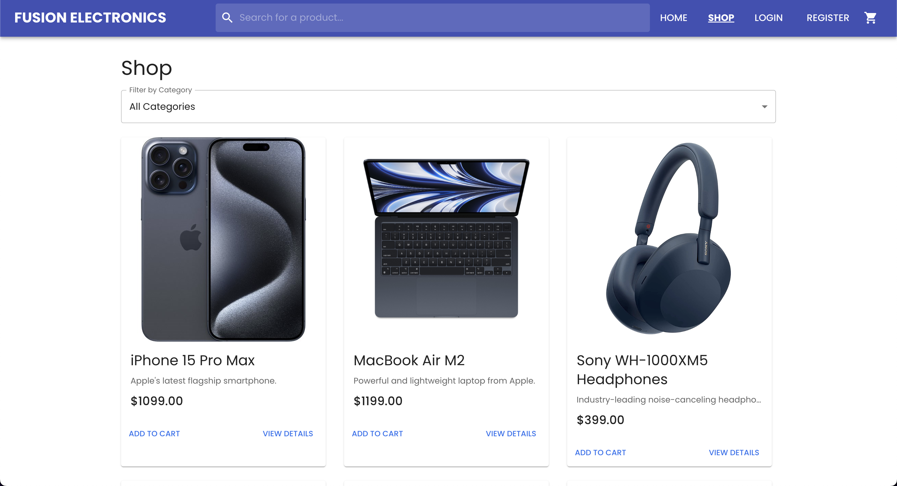
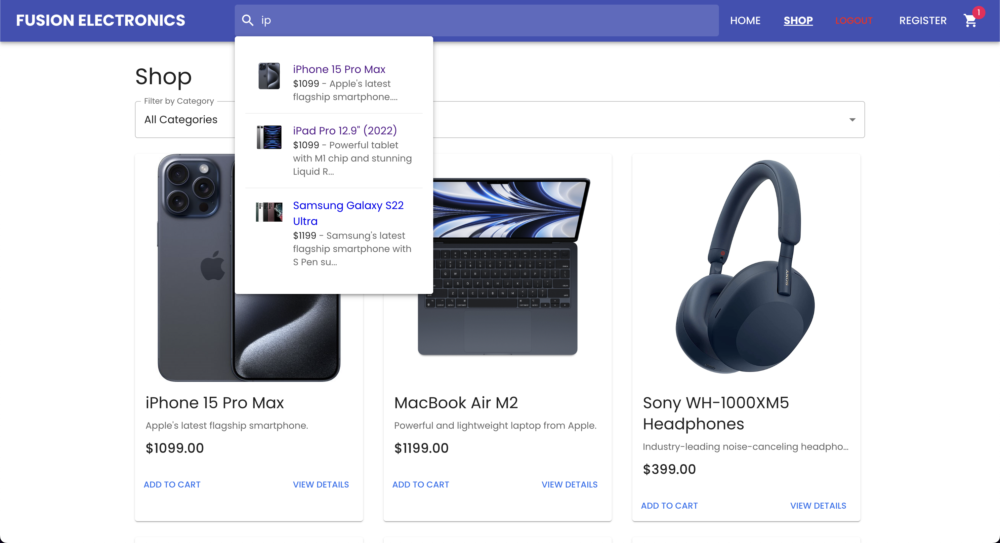
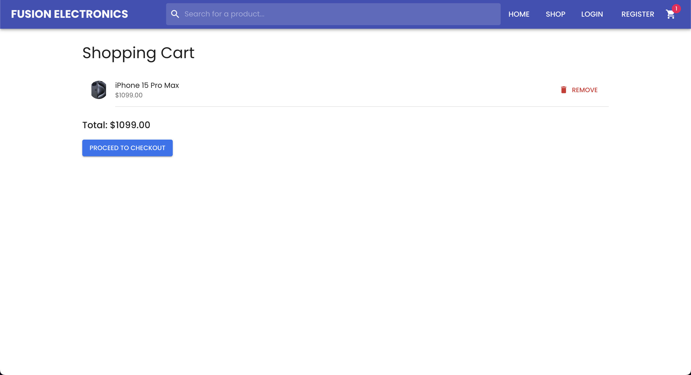
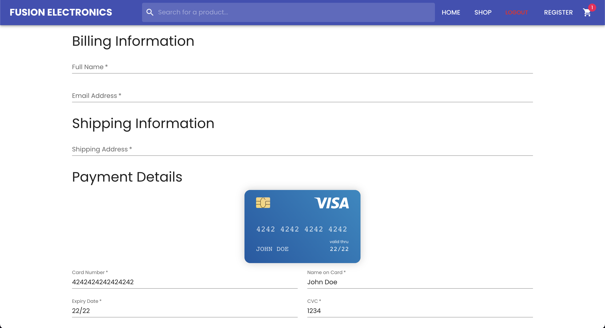
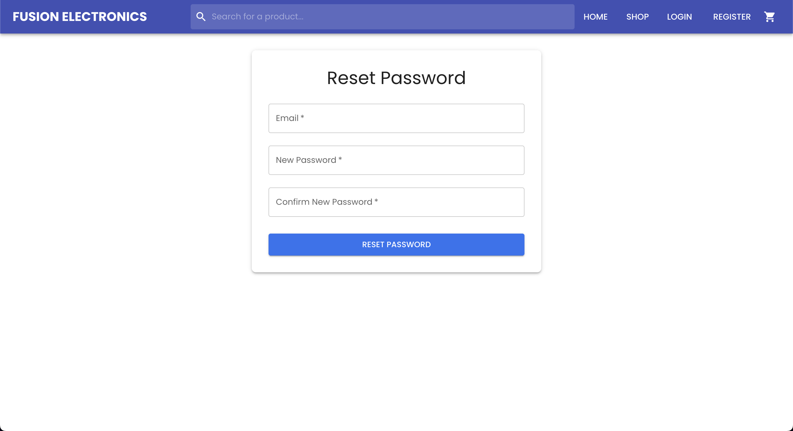

# ELECTRONIC SHOP: A MERN-Stack E-commerce Application

## Table of Contents

1. [Introduction](#introduction)
2. [Live Deployment](#live-deployment)
3. [User Interface](#user-interface)
   - [Home Page](#home-page)
   - [Full Product List](#full-product-list)
   - [Cart Page](#cart-page)
   - [Checkout Page](#checkout-page)
4. [Features](#features)
5. [Technologies Used](#technologies-used)
6. [Getting Started](#getting-started)
    - [Prerequisites](#prerequisites)
    - [Installation](#installation)
7. [Project Structure](#project-structure)
8. [Running the Application](#running-the-application)
9. [Testing the APIs](#testing-the-apis)
10. [Swagger API Documentation](#swagger-api-documentation)
11. [OpenAPI Specification](#openapi-specification)
    - [Using the `openapi.yaml` File](#using-the-openapiyaml-file)
12. [Deployment](#deployment)
13. [Containerization](#containerization)
14. [Contributing](#contributing)
15. [License](#license)
16. [Creator](#creator)

## Introduction

This project is a demonstration of building an e-commerce application using the MERN stack, which consists of MongoDB (database), Express.js (server), React.js (frontend), and Node.js (runtime environment). The application allows users to browse products, add them to a shopping cart, proceed to checkout, and simulate the order processing. It includes basic validations for user inputs and simulates the checkout process on the backend.
S
## Live Deployment

The application is deployed live on Vercel. You can access it at the following URL: [ELECTRONIC SHOP](https://fusion-ecommerce-app.vercel.app).

The backend server is deployed on Render and can be accessed at the following URL: [ELECTRONIC SHOP API](https://mern-stack-ecommerce-app-h5wb.onrender.com/).

> **Note**: The backend server may take a few seconds to wake up if it has been inactive for a while. For your information, it is hosted on the free tier of Render, with 0.1 CPU and 512 MB of memory only, so it may take a bit longer to respond to requests, especially after periods of inactivity.

## User Interface

### Home Page

<p align="center">
    
</p>

### Full Product List

<p align="center">
    
</p>

### Search Results

<p align="center">
    
</p>

### Product Details Page

<p align="center">
    
</p>

### Cart Page

<p align="center">
    
</p>

### Checkout Page

<p align="center">
    
</p>

### Login Page

<p align="center">
    
</p>

### Register Page

<p align="center">
    
</p>

### Forgot Password Page

<p align="center">
    
</p>

### Reset Password Page

<p align="center">
    
</p>

### Order Confirmation

<p align="center">
    
</p>

## Features

- **Product Management:**
    - View a list of products.
    - View detailed product information.
    - Add products to the shopping cart.

- **Shopping Cart:**
    - View items in the shopping cart.
    - Remove items from the cart.
    - Calculate total amount of items in the cart.

- **Checkout Process:**
    - Enter billing, shipping, and payment information.
    - Simulate the order creation process on the backend.
    - Receive confirmation of order success.

## Technologies Used

- **Frontend:**
    - React.js
    - Material-UI for styling
    - Axios for API requests
    - `react-credit-cards-2` for credit card visualization
    - `react-router-dom` for routing
    - `react-hook-form` for form validation
    - `react-toastify` for toast notifications
    - Jest and React Testing Library for testing

- **Backend:**
    - Node.js
    - Express.js
    - MongoDB (with Mongoose ODM)
    - Axios for external API requests
    - JsonWebToken for user authentication
    - Bcrypt for password hashing
    - Dotenv for environment variables
    - Cors for cross-origin resource sharing
    - Swagger for API documentation
    - Nodemon for server hot-reloading
    - **Middleware**: JWT for securing API endpoints

- **Development Tools:**
    - Jetbrains WebStorm (IDE)
    - Postman (for API testing)
    - Git (version control)
    - npm (package manager)

## Project Structure

The project is organized into two main "stacks": The backend is in the `backend` directory that hosts all product & order data and the frontend is in the `root` directory. Here is an overview of the project structure:

```
fullstack-ecommerce/
├── backend/                       # Node.js server files
│   ├── config/                    # Configuration files
│   │   └── db.js                  # Database connection
│   ├── models/                    # Mongoose models
│   │   └── product.js             # Product schema
│   ├── routes/                    # Route handlers
│   │   ├── products.js            # Product routes
│   │   ├── search.js              # Search routes
│   │   └── checkout.js            # Checkout routes
│   ├── seed/                      # Database seed data
│   │   └── products.js            # Product seed data
│   ├── .env                       # Environment variables
│   └── index.js                   # Server entry point
├── public/                        # Frontend public assets
│   ├── index.html                 # HTML template
│   ├── manifest.json              # Web app manifest
│   └── favicon.ico                # Favicon
├── src/                           # React.js frontend files
│   ├── components/                # Reusable components
│   │   ├── CheckoutForm.jsx       # Checkout form component
│   │   ├── ProductCard.jsx        # Product card component
│   │   ├── NavigationBar.jsx      # Navigation bar component
│   │   ├── OrderConfirmation.jsx  # Order confirmation component
│   │   ├── ProductListing.jsx     # Product listing component
│   │   ├── SearchResults.jsx      # Search results component
│   │   └── ShoppingCart.jsx       # Shopping cart component
│   ├── dev/                       # Development utilities
│   │   ├── index.js               # Development entry point
│   │   ├── palette.jsx            # Color palette
│   │   ├── preview.jsx            # Component preview
│   │   └── useInitials.js         # Initials hook
│   ├── pages/                     # Page components
│   │   ├── Cart.jsx               # Cart page component
│   │   ├── Checkout.jsx           # Checkout page component
│   │   ├── Home.jsx               # Home page component
│   │   ├── ProductDetails.jsx     # Product details page component
│   │   ├── OrderSuccess.jsx       # Order success page component
│   │   ├── ProductDetails.jsx     # Product details page component
│   │   └── Shop.jsx               # Shop page component
│   ├── App.jsx                    # Main application component
│   ├── App.css                    # Main application styles
│   └── index.js                   # React entry point
├── build/                         # Frontend production build files
├── tests/                         # Test files
├── .gitignore                     # Git ignore file
├── package.json                   # NPM package file
├── jsconfig.json                  # JS config file
└── setupProxy.js                  # Proxy configuration
```

## Getting Started

### Prerequisites

Before running this project, ensure you have the following installed:

- Node.js (with npm)
- MongoDB (with either local or remote instance)
- Git

### Installation

1. Clone the repository:
   ```bash
   git clone https://github.com/shivammiyyy/Ecommerce.git
   cd MERN-Stack-Ecommerce-App  # Fix the path if necessary
   ```

2. Install project dependencies:
   ```bash
   # Install server (backend) dependencies
   cd backend
   npm install

   # Install client (frontend) dependencies
   cd ..
   npm install
   ```
   
3. Set up the backend:

   - Create a `.env` file in the `backend/` directory and add the following environment variable (replace the URI with your MongoDB connection string):
     ```
     MONGO_URI=mongodb://localhost:27017/Ecommerce-Products
     JWT_SECRET=your_secret_key
     ```
     
     For your information, I am using MongoDB Atlas for this project. You can create a free account and get your connection string from there if you want to deploy the application to the cloud.
 
    - Ensure that your MongoDB server is running. If you're using Mac, you can start the MongoDB server with the following command:
     ```bash
     brew services start mongodb-community
     ``` 

   - Seed the database with sample data:
     ```bash
     cd backend/seed
     node productSeeds.js dev
     ```
     
   - Run the backend server: (first `cd` into the backend directory)
     ```bash
     cd ..
     npm start
     ``` 
     
4. Set up the frontend:
   - First, `cd` into the `root` directory if you are not already there:
     ```bash
     cd ..
     ```
     Or
        ```bash
        cd fullstack-ecommerce
        ```
   - Start the frontend development server:
     ```bash
     npm start
     ```
   - **Note:** The frontend server will run on `http://localhost:3000` by default. If you encounter any errors when starting related to the `react-credit-cards-2` package, it is OK to just ignore them as the application will still run correctly.

## Running the Application

- Open your browser and navigate to `http://localhost:3000` to view the application.

## Creator

- ** Shivam Kumar** - [shivammiyy](https://github.com/shivammiyy)
- **Email:** [skj326212@@gmail.com](skj326212@gmail.com).


